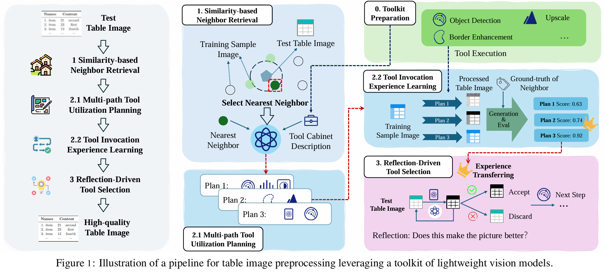

# NGTR

This is the official implementation of the paper: Enhancing Table Recognition with Vision LLMs: A Benchmark and Neighbor-Guided Toolchain Reasoner.

## Introduction

We propose the Neighbor-Guided Toolchain Reasoner (NGTR) framework, which combines lightweight models and retrieval-augmented generation strategies to enhance input image quality and guide structured data recognition in table recognition tasks. Through extensive experiments on multiple public table recognition datasets, we demonstrate that the NGTR framework significantly enhances the performance of naive VLLM-based approaches. Our findings highlight the promising potential of VLLMs in table recognition and pave the way for future research and development in the field.

The main contribution of this work can be summarized as:

- We pioneer the use of VLLM-based approaches for table recognition tasks, introducing a comprehensive benchmark with hierarchical evaluation settings.

- We propose the NGTR framework, which addresses critical bottlenecks in table recognition, such as low-quality input images.

- We conduct extensive experiments, demonstrating the promising performance of VLLMs for table recognition and providing insights into areas for future research.




## Environment

NGTR is implemented under the following environment: `python==3.9.19`. 
Run following command to load the environment. 

```
conda create -n NGTR python=3.9 -y
conda activate NGTR
pip install -r requirements.txt
```

## Running

Open terminal and run the main.py file.
```
python main.py
```
Following the argument instruction in `main.py` to modify the setting.

## Acknowledgement

This repo is built on the pioneer works. We appreciate the following GitHub repos a lot for their valuable code base or datasets:

[SciTSR](https://github.com/Academic-Hammer/SciTSR)

[PubTabNet](https://github.com/ibm-aur-nlp/PubTabNet)

[WTW-Dataset](https://github.com/wangwen-whu/WTW-Dataset)

[yolov10](https://github.com/THU-MIG/yolov10)

[upscayl](https://github.com/upscayl/upscayl)
